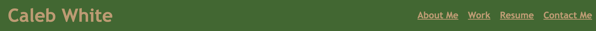
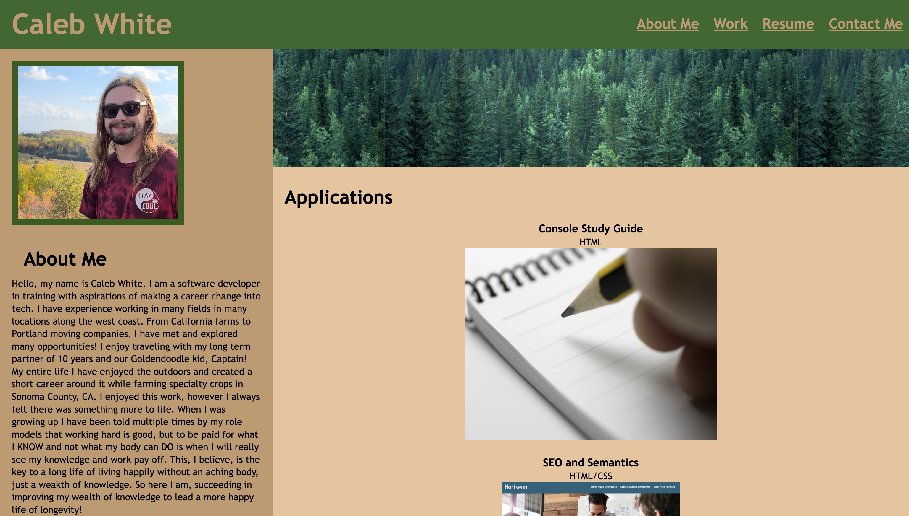

# Portfolio-site

## Description

This was a fun project made from scratch to display the projects I have created or worked on to date. It was structure, formatted, and designed entirely by me, Caleb White. This is a fun and interactive way to see my progress just one month after beginning my coding journey. The site was created using solely HTML and CSS, and it is much more inviting to look at rather than just a resume file. It gives some insight into who I am by the way it was designed and structured. I learned to navigate many struggles of formating and designing ans it still isn't perfect. I also discovered how process and logic come together with creativity to create something developed on the web.

## Installation

N/A

## Usage

Once arrived at the site, one may scroll to see a small "About Me" section, my work done so far, a resume, and a way to get in touch with me if interested. *As a side note, this is not my actual phone number, so please don't expect to reach me that way. 
Below you will see the nav bar with working links: 

These links will take you to the rest of the site!

## Credits

Credit to the sites that provided images such as the note taking image provided by: https://irisreading.com/how-and-when-to-take-notes/ 
and the forest image provided by: https://www.istockphoto.com/photo/evergreen-forest-background-banner-gm171210464-2031897

Many thanks to those two sites as well as my TA Austin who helped with part of the responsive design parameters. 

## License

N/A

## Tests

Links: click on links -> check: good
Photo links: click on photos -> check: good
Responsive to screen size: change scrren size -> check: good